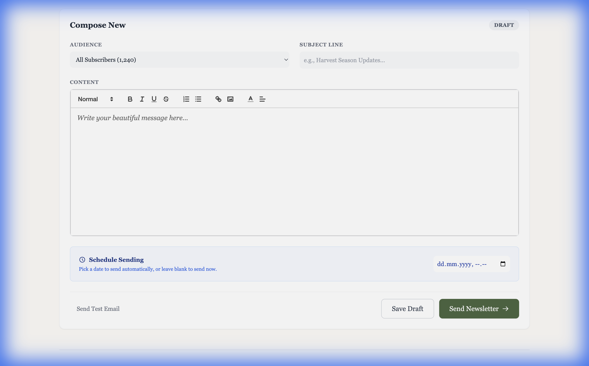
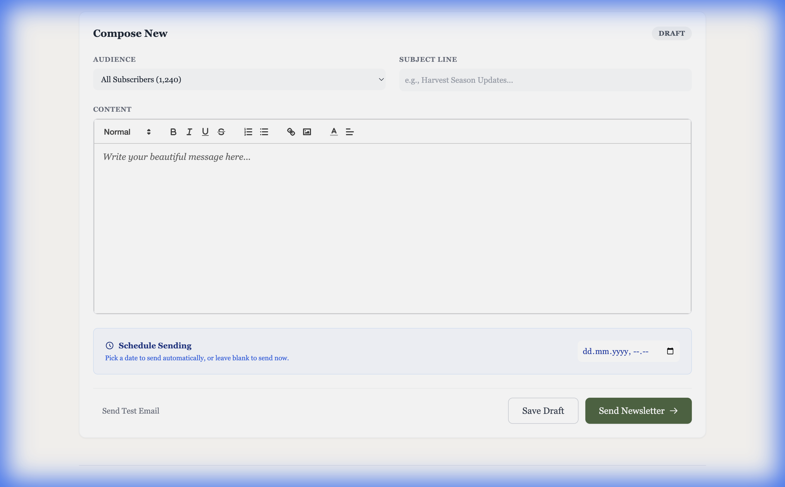
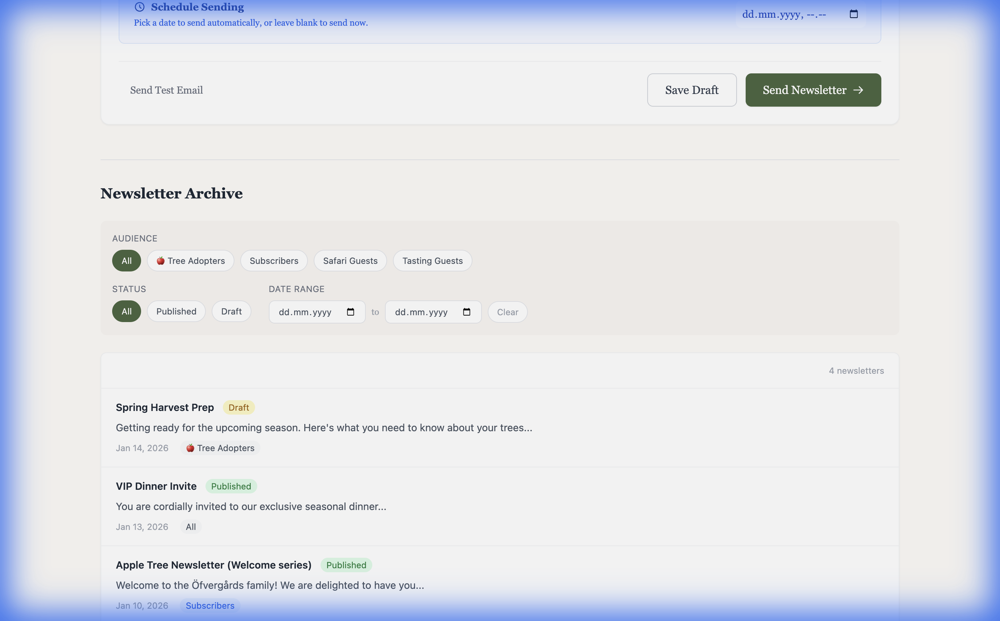

# User Manual: Managing Newsletters & Updates

Welcome to the **Updates Manager**! This guide will help you create, format, schedule, and manage your newsletters easily.

## 1. Creating a Newsletter

To start a new update, navigate to the **Updates** section in the admin panel.
You will see a form where you can compose your message.

### Key Steps:
1.  **Audience**: Select who should receive this update (e.g., All Users, Subscribers, or specific groups).
2.  **Subject Line**: Enter a clear and engaging subject for your email.
3.  **Content**: Type your message in the main text area.

---

## 2. Formatting Your Message

You can make your newsletter look professional using the formatting toolbar at the top of the text editor.

### Available Tools:
-   **Bold/Italic**: Emphasize important text.
-   **Lists**: Create bulleted or numbered lists for clarity.
-   **Links**: Insert links to your website or other resources.
-   **Code/Quote**: Format technical text or quotes specifically.

Simply highlight the text you want to format and click the corresponding button in the toolbar.

---

## 3. Scheduling Your Newsletter

You don't have to send your newsletter immediately. You can schedule it for a later date and time.

### How to Schedule:
1.  Look for the **"Schedule Sending"** or similar section.
2.  Select the **Date** and **Time** you want the email to be sent.
3.  The system will automatically send it at the chosen moment.

---

## 4. Managing Past Newsletters (Archive & Filtering)

You can view all your past newsletters in the **Newsletter Archive**. This list helps you keep track of what has been sent and to whom.

### Using Filters:
-   **Filter by Audience**: Quickly find emails sent to specific groups.
-   **Filter by Status**: See only "Published" (sent) or "Draft" (unsent) newsletters.
-   **Date Range**: Narrow down the list to a specific time period.

Use these filters to easily find past communications without scrolling through the entire list.
